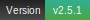

# 🎀 Silk Carousel 🎀


[](https://paypal.me/dy55)[](.github/info/alipayQR_dy55.jpg)[](.github/info/wechatQR_dy55.png)

## ✨ Features ✨

A light-weight website carousel plugin.

The program is written in JavaScript and CSS.

***

*The min files were created via Minify for VS Code and MinifyAll for VS Code*

The updates are coming. Thanks for your support! 😋

**The brand new carousel is under construction!**

> ### Update version 2.4.1
>
> **Silk Carousel 2.4.1 is here.**
>
> Target name and theme name are separated in the new version.
>
> Added optional play/pause status display.
>
> Code has been optimized.

***

## 🎯 Usage 🎯

1. Import the files

	i. Link the CSS file
		
	```HTML
	<link type="text/css" rel="stylesheet" href="css/carousel_2.4.1.css" />
	```
	The theme CSS file should be linked behind the main CSS file.

	ii. Import JQuery

	```HTML
	<script src="js/jquery.js"></script>
	```

	iii. Import the JS file

	```HTML
	<script src="js/carousel_2.4.1.js"></script>
	```
	The theme JS file should be imported behind the main JS file.

2. Create a div

	```HTML
	<div id="bannerCarousel"></div>
	```

3. Call function
	

	```HTML
	<script type="text/javascript">
	    carouselRun({
	            _target: "#bannerCarousel",
	            theme: "the-taste-of-sky",
	            width: "80%",
	            height: "550px",
	            imageSrcs: [
	            	"images/qd1.jpg",
	            	"images/qd2.jpg",
	            	"images/qd3.jpg",
	            	"images/qd4.jpg",
	            	"images/qd5.jpg",
	            	"images/qd6.jpg",
	            	"images/qd7.jpg"
	            ],
	            anchorHrefs: [
	            	"images/qd1.jpg",
	            	"images/qd2.jpg",
	            	"#",
	            	"images/qd4.jpg",
	            	"images/qd5.jpg",
	            	"images/qd6.jpg",
	            	"#"
	            ],
	            htBoardTexts: [
	            	"<label>Brio of Qingdao</label><h2>May 4th Square</h2>",
	            	"",
	            	"",
	            	"<h2>Christian Church in Qingdao</h2>",
	            	"<h2>Olympic Sailing Center</h2>",
	            	"<h2>Landing Stage</h2>",
	            	"Let's find the beauty of Qingdao together!",
	            ]
	        });
	</script>
	```
				
### Function Information

```JavaScript
//function information
function carouselRun(info = {
    _target: new String,                 //Target Name (ID/Class/...)
    theme: new String,                   //Theme Name
    width: new String,                   //Width (Default: "60%")
    height: new String,                  //Height (Default: "450px")
    imageSrcs: new Array,                //Images URLs Array
    anchorHrefs: new Array,              //Links Hrefs Array
    htBoardTexts: new Array,             //Hyper-text Board Contents for Each Slide
    _outline: new Boolean,               //Show Outline (Default: true)
    playToggleBtn: new Boolean,          //Show Play/Pause Button (Default: true)
    mouseLeaveHideBtn: new Boolean,      //Hide Buttons When Mouse Leaves (Default: true)
    buttonsFilter: new Array,            //Buttons' Filters for Each Slide
    htBoardFilter: new Array,            //Hyper-text Board Filters for Each Slide
    htBoardBackground: new Boolean,      //Show Background of the Hyper-text Board (Default: true)
    customLearnMoreContent: new Array,   //Custom Content of "Learn More" Button for Each Slide
    startFrom: new Object,               //Start from Which Slide (Default: 1)
    progressBarFilters: new Array,       //Progress Bars' Filters for Each Slide
    showStatus: new Boolean              //Whether show status box (Default: true)
}){...}

```

**<> with 💖 by dy55**
